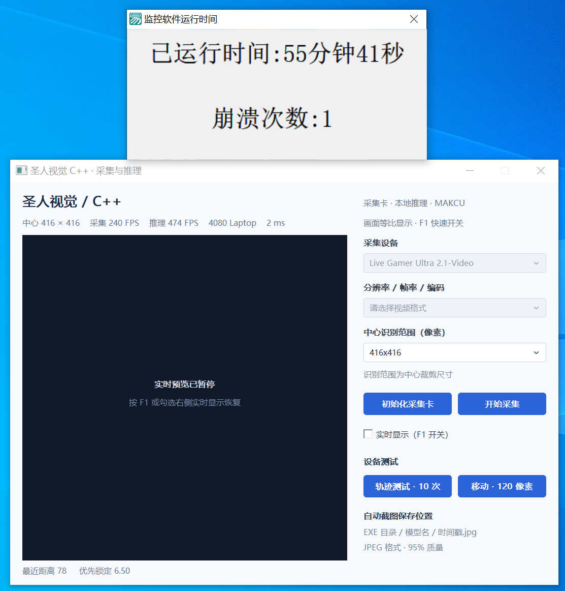
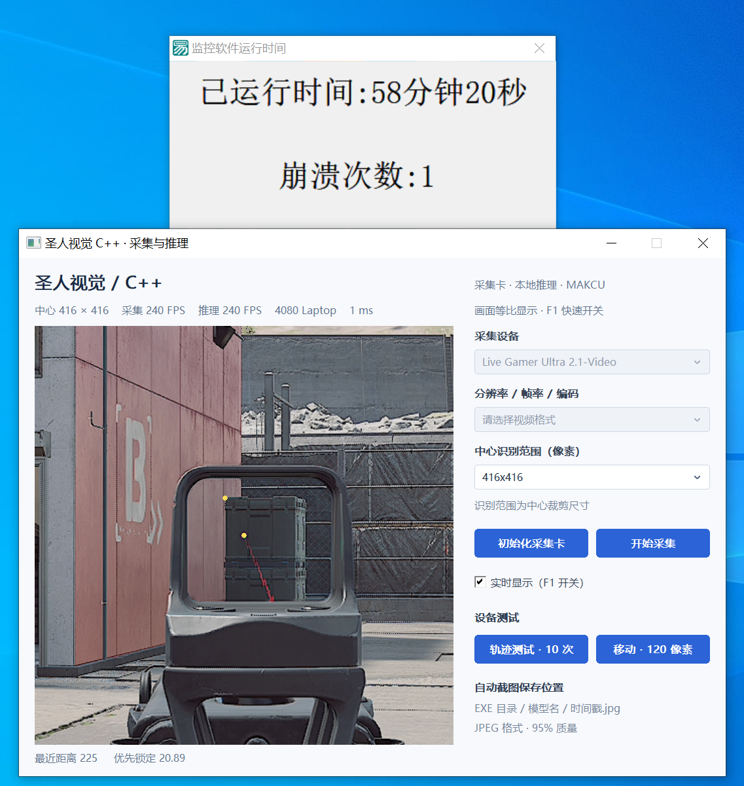
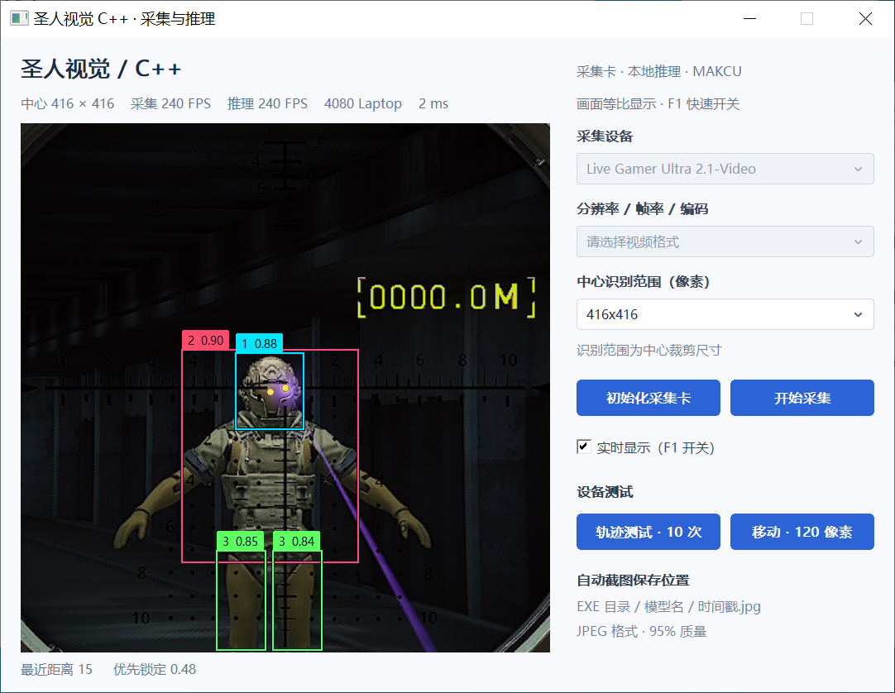
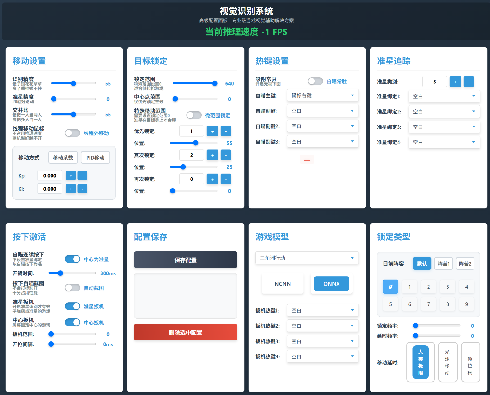

# SagaApp（圣人双机服务端）

采集卡取帧 → YOLO 推理 → Makcu 串口鼠标控制的 Windows 桌面程序。
它是易语言原版「圣人自用 / 圣人双机」的 C++ 翻写版：界面、配置项、数值语义都对齐易语言原版，
但把原版依赖的 `Saga.dll`（采集 + NCNN/ONNX + 串口）源码直接编进了 EXE，**运行时不再需要 Saga.dll**。

- 工程：`Saga.sln` 包含 `SagaApp.vcxproj`（主程序）与 `TrtConverter.vcxproj`（ONNX 转换工具）/ 源码：`src\`
- 目标：**x64 Release**（工程只配了 x64，没有 Win32 配置）
- 产物：`x64\Release\圣人双机服务端.exe`（TargetName 已改名，不是 SagaApp.exe）
- 转换工具：`x64\Release\ONNX转TRT工具.exe`；模型及输出 `.trt` 不随源码入库
- 许可：本项目主体 **GPL-3.0**（`LICENSE`）；第三方代码与数据见 `THIRD-PARTY-NOTICES.md`

---

## 0. 运行效果

2026-10-03 新增“N卡专用推理”和独立 ONNX 转 `.trt` 工具。转换工具固定生成 FP16：直接选择普通 ONNX 即可，原文件保留，默认保存到程序旁的 `模型数据` 文件夹。三个引擎统一从 `EXE目录\模型数据\` 加载，网页汇总该文件夹内的实际模型名称，按当前模型的同名文件启用引擎按钮，缺少对应文件时变灰并禁止点击。同批 2048 张图片对照，TensorRT FP16 默认使用 CUDA Graph＋阻塞同步，平均耗时约 0.679 ms，比 ONNX / DirectML 约低 46.81%；7 张图片的检测数量或类别数量有变化。原有两种引擎保留，不自动切换。支持范围、数值差异与转换步骤见 [N卡专用推理使用说明](docs/TensorRT使用说明.md)。

本次更新 OpenCV 5.0.0、ONNX Runtime 1.30.0（保留 CPU / DirectML）和 Asio 1.38.2；NCNN 20260526、DirectML 1.15.4 经核查保持当前稳定版。YOLOs-CPP、MAKCU 保留维护分支并合并或核查适用修正，Cat SDK 按用户要求保留。版本、来源、性能对照和分支状态见 [依赖更新记录](docs/依赖更新-2026-10-02.md)。SDK 统一位于项目 `.deps`。

2026-10-02 已实测采集＋ONNX 约 240 FPS，并验证可选 FP16 ONNX 模型的图片识别平均耗时约降低 10%。网页中的 ONNX FP16 加速选项现已移除，FP16 使用上面的 N卡专用推理转换工具。模型不随源码入库，原模型及默认配置保留；FP16 有少量检测变化。历史测试范围、精度差异和排除的实验见 [采集与 YOLO 性能实测](docs/性能实测与优化-2026-10-02.md)。库升级本身未带来明确提速，具体对照见依赖更新记录。

2026-09-30 更新修复部分 MAKCU 固件在鼠标按键时被误判断开的兼容问题，并将启动、驱动、串口和网络诊断合并为有容量上限的异步日志。详见 [2026-09-30 更新说明](docs/更新说明-2026-09-30.md) 和 [更新日志](CHANGELOG.md)。

原生人手数据采集、CPU 训练与模型热加载、局域网网页调参、网络自检及窗口标题实际 IP 的使用方法见 [2026-09-29 更新说明](docs/更新说明-2026-09-29.md)。






🎬 **[观看完整运行演示（36 MB，放在 Release 附件）](https://github.com/ChinaSaga/saga-capture-aim/releases/latest)**

> 视频没放进仓库：GitHub 的 Markdown 渲染器不支持内联播放仓库里的 mp4（`<video>` 会被清掉，
> raw 链接只会触发下载），而且 36 MB 会让每次 `git clone` 都变慢。
> 放在 Release 附件里，点开即可播放，仓库体积保持在 11 MB 左右。

---

## 1. 30 秒构建

```powershell
cd D:\C++采集卡源码
./tools/build.ps1
```

构建后会自动把运行时 DLL 拷到输出目录（`RuntimeDependencies.targets`，仅 x64 生效）：
NCNN、OpenCV、ONNXRuntime、DirectML 及 VC 运行库。
许可证同时复制到输出目录 `licenses`；CPU / DirectML 不需要 `onnxruntime_providers_shared.dll`，构建会清理旧输出中的该文件。

首次在另一台机器构建时，先准备依赖（ONNX Runtime 会从官方源码编译，耗时明显长于应用编译）：

```powershell
./tools/install_dependencies.ps1 -Python 'C:\你的Python目录\python.exe'
./tools/install_tensorrt.ps1
./tools/build.ps1
```

重新编译还需要 CUDA 13.4 Toolkit，并设置 `CUDA_PATH`（或构建属性 `SagaCudaDir`）。这属于开发环境要求；已有程序使用普通 NCNN / ONNX 时，不要求 NVIDIA 显卡或启动 N卡专用引擎。构建同时生成主程序和转换工具。

细节、依赖版本、排错见 **[docs/构建与部署.md](docs/构建与部署.md)**。

---

## 2. 运行需要什么（模型放入“模型数据”子目录）

| 文件 | 来源 | 说明 |
|---|---|---|
| CH343 串口驱动 | **已打进 EXE 资源** | Makcu 盒子（WCH CH343 USB 转串口）的驱动，检测到没装会自动静默安装，见下 |
| `DirectML.dll`、`ncnn.dll`、`onnxruntime.dll`、`opencv_world500.dll` | 随构建复制 | 缺一项启动时弹「缺少 …」并退出 |
| VC 运行库 `msvcp140*.dll`、`vcruntime140*.dll`、`vcomp140.dll` 等 | 随构建复制 | 工程用 `/MD` |
| `人手数据\mouse.bin`（兼容旧的 `mouse.bin`） | 主界面点击“点我开始记录人手数据”和“点我开始训练人手模型”生成 | 缺失时仍可进入界面采集训练；训练成功后自动替换并加载，无需重启。使用说明见 [人手轨迹\README.md](人手轨迹/README.md) |
| 红蓝球采集与 CPU 训练 | 已编入 EXE 的原生 C++ 功能 | 两个按钮直接使用，无需安装 Python、PyTorch 或其它训练环境 |
| `模型数据\<模型名>.param` + `模型数据\<模型名>.bin` | 用户自备 | NCNN 模型（`推理引擎=1`） |
| `模型数据\<模型名>.onnx` + `模型数据\空类别.txt` | 用户自备 | ONNX 模型（`推理引擎=2`，缺类别文件会写空文件） |
| `模型数据\<模型名>.trt` | 本机 `ONNX转TRT工具.exe` 从原 ONNX 生成 | N卡专用推理（`推理引擎=3`）；支持范围见 TensorRT 使用说明 |
| TensorRT / CUDA 运行库 | 随构建复制 | 仅 N卡专用推理或转换工具使用，普通 NCNN / ONNX 路径不要求 NVIDIA 显卡 |
| `圣人自用.js` | 首次启动自动按默认值生成 | 全部配置键值对 |
| `主机IP.ini` | 旧版文件，新版不再读取或生成 | 启动不询问 IP；点击“打开本机调参”使用实际本机地址，局域网地址见“本机网络检查” |
| `圣人视觉识别系统.html` | 与 EXE 放在同一目录 | 使用外部网页文件；缺失时访问 IP 显示“网页不存在”，调参接口停用；补回文件后刷新恢复 |
| `监控双机.ini` | 按需要 | 双机模式下自动出图：`[保留参数] 宽/高/编码/名称/帧率/截图范围` |

启动及异常诊断统一写入 EXE 同目录的 UTF-8 `运行日志.txt`，排错时先查它。日志通过内存队列异步批量写入；超过 2000 行清理旧记录并保留最近 1000 行，同时限制在 1 MiB 内。正常推理、鼠标移动和按键不逐帧记录。详见 [日志与性能](docs/日志与性能.md)。
界面变量记忆写 `配置保存.ini`，配置快照/网页多配置写在 `配置保存\` 目录。

启动在后台预设当前程序的局域网防火墙规则，并验证本机 HTTP、网页文件和网络状态。
HTTP 首选 8888，端口冲突会自动回退；80 可用时支持直接访问 IP。局域网绑定被系统拒绝时尝试仅监听本机。
“本机网络检查”保留内存中的完整诊断报告；网络状态变化写入统一的 `运行日志.txt`，不影响主窗口启动。
本机自检通过不代表其他设备必然可达；路由器隔离、VPN 或系统管理策略等限制会按可检测范围提示。

### 关于那个 USB 串口驱动

Makcu 盒子用的是 WCH **CH343** 芯片，Windows 没有内置它的驱动，没装时枚举不到 COM 口。
本程序把驱动（WCH 官方 2.0.2025.03，WHQL 签名）以资源形式打包进 EXE。
先显示主界面，再在后台检查和连接；右上角显示 MAKCU 状态：

1. 串口已就绪时直接连接；未插盒子时跳过安装、硬件扫描和连接等待，已有驱动保持不变。
2. 只有发现受支持的设备、但串口不可用时，才从资源释放 9 个驱动文件和官方安装器，运行 `DRVSETUP64.exe /S`。
3. 必要时再执行 `pnputil /add-driver CH343SER.INF /install`
   → **`UpdateDriverForPlugAndPlayDevices` 强制装到当前在场的设备上**（官方安装器同款 API）
   → **重枚举设备节点**（`CM_Reenumerate_DevNode`）→ `pnputil /scan-devices`
   —— 重枚举这一步是关键：它等价于帮你拔插一次，所以**盒子不用拔插就能用**

驱动检查和修复报告统一写入 `运行日志.txt`，不再生成单独的驱动、串口或网络报告文件。
异常显示在右上角并记录日志，不用阻塞弹窗等待确认。启动日志包含毫秒计时，便于定位延迟。
如果启动时没插盒子，插入后重新启动即可连接；必要的安装和连接重试不会阻塞主界面。

**代价：安装驱动要管理员权限**，所以 EXE 清单声明了 `requireAdministrator` —— 双击时会弹一次系统 UAC。
详见 [docs\架构与源码索引.md](docs/架构与源码索引.md) 和 `src\DriverRes.rc` 顶部注释。

---

## 3. 目录结构

```
D:\C++采集卡源码
├── Saga.sln / SagaApp.vcxproj         主程序（Release|x64、Debug|x64）
├── TrtConverter.vcxproj               独立 ONNX 转 TRT 工具
├── Dependencies.props / dependencies.lock.json  SDK 路径、固定版本与来源校验
├── .deps\                            本地 SDK 与下载缓存（不入库）
├── RuntimeDependencies.targets        构建后自动复制第三方 DLL
├── .gitignore / .gitattributes        入库规则：排除产物、DLL、模型、私有目录
├── 圣人自用.sample.js                 配置模板（入库版本；真实 `圣人自用.js` 被忽略）
├── src\                               全部源码（应用层 + 引擎层 + Makcu）
│   ├── 应用层：main / Ui / Util / Capture / Aim / Input / Net / DriverSetup / RuntimeLog
│   ├── drv\                           打进 EXE 的 CH343 驱动（INF/CAT/SYS/DLL）
│   ├── DriverRes.rc                   资源：驱动文件 + 提权清单
│   ├── app.manifest                   清单本体（requireAdministrator）
│   ├── 引擎层：OpnecvCapture / NCNN / ONNX / Mouse（原 Saga.dll）
│   ├── 头-only：App.h / Inference.h / AimLock.h / CapturePixels.h /
│   │            TensorPixels.h / NcnnPostprocess.h / FrameWait.h
│   ├── ONNX 侧：preprocessing.hpp detection.hpp nms.hpp session_base.hpp …
│   └── Makcu\                         串口协议 + Cat(网络键鼠，暂未启用) + 自带 asio
├── web\圣人视觉识别系统.html           网页控制面板（部署到 EXE 同目录，同源 API）
├── 人手轨迹\                          采集/训练说明与保留的 Python 参考脚本；EXE 使用 src 内的原生 C++ 实现
├── x64\Release\                       构建输出（EXE + PDB + 运行时 DLL + 配置，不入库）
├── docs\                              本文档与其配套文档
│   └── reference\                     GPU 型号表数据源（pci.ids 等）
└── .workbuddy\                        不属于源码：构建脚本、记忆、备份
    ├── build.sh                       x64 手工构建脚本（MSBuild 不可用时）
    ├── memory\                        会话记忆（勿删）
    ├── backup\                        历史备份与归档（可删，勿回滚覆盖）
    └── 易语言原版备份\                原版易语言源码（对照用，只读）
```

---

## 4. 文档索引

| 文档 | 看什么 |
|---|---|
| [CHANGELOG.md](CHANGELOG.md) | 按日期汇总更新及详细说明入口 |
| [docs/TensorRT使用说明.md](docs/TensorRT使用说明.md) | N卡专用引擎、模型转换、目录刷新与实测范围 |
| [docs/依赖更新-2026-10-02.md](docs/依赖更新-2026-10-02.md) | 库版本、维护分支、构建部署与新旧依赖对照 |
| [docs/性能实测与优化-2026-10-02.md](docs/性能实测与优化-2026-10-02.md) | 真实图片、采集卡、可选 FP16 和精度差异 |
| [docs/更新说明-2026-09-30.md](docs/更新说明-2026-09-30.md) | 最新 MAKCU 按键兼容修复、统一日志与验证结果 |
| [docs/构建与部署.md](docs/构建与部署.md) | 环境、第三方库路径、编译开关、产物、部署、排错 |
| [docs/架构与源码索引.md](docs/架构与源码索引.md) | 模块职责、数据流、帧格式、线程表、锁约定 |
| [docs/配置与运行时接口.md](docs/配置与运行时接口.md) | `圣人自用.js` 键表、HTTP 接口、**网页端**与参数、UI 控件、ini 文件 |
| [docs/日志与性能.md](docs/日志与性能.md) | 运行日志内容、异步写入、自动清理和排错范围 |
| [docs/维护红线与已知问题.md](docs/维护红线与已知问题.md) | 不能改的东西、易语言语义坑、与原版差异、历史优化结论 |

---

## 5. 仓库包含 / 不包含什么（准备上传 GitHub）

**入库**：`README.md`、`CHANGELOG.md`、`docs\`（含 `reference\`）、`src\`、`tools\`（开发测试）、`web\`、`人手轨迹\`（说明与参考脚本，**不含个人采集数据**）、`Saga.sln`、`SagaApp.vcxproj`、
`TrtConverter.vcxproj`、`Dependencies.props`、`dependencies.lock.json`、`RuntimeDependencies.targets`、`圣人自用.sample.js`、`.gitignore`、`.gitattributes`、`LICENSE`、`THIRD-PARTY-NOTICES.md`。

**不入库**（见 `.gitignore`）：

| 类别 | 内容 | 原因 |
|---|---|---|
| 构建产物 | `x64\Release\`、`*.obj/pdb/tlog/log`、VC 中间目录 | 可由源码重建 |
| 第三方 SDK / DLL | `.deps\`、ncnn / OpenCV / ONNXRuntime / DirectML / VC 运行库 | 按锁定版本准备，构建时自动复制 |
| **模型** | `*.onnx`、`*.param`、`*.bin`（含 NCNN 权重） | 体积大、非本仓库产出、可能涉及第三方授权 |
| 个人数据 | `mouse.bin`（人手轨迹）、`圣人自用.js`、`主机IP.ini`、`监控双机.ini`、`配置保存*`、`运行日志.txt` | 含个人 IP 与调参结果 |
| 私有辅助 | `.workbuddy\`（会话记忆、备份、易语言原版源码 19 MB）、`.vs\` | 非项目本体 |

克隆后要跑起来：先按 [docs/构建与部署.md](docs/构建与部署.md) 构建，将目标识别模型放到 EXE 旁的 `模型数据` 文件夹，网页放到 EXE 同目录。构建和主程序启动会创建模型文件夹；旧版位于 EXE 根目录的识别模型需移入此文件夹。人手模型可通过记录、训练按钮生成，也可使用已有 `mouse.bin`；配置可将 `圣人自用.sample.js` 复制为 `圣人自用.js`，未提供时按默认值生成。

**注意**：第三方代码与数据的授权见 [THIRD-PARTY-NOTICES.md](THIRD-PARTY-NOTICES.md) ——
YOLOs-CPP 上游为 AGPL-3.0，MAKCU 上游为 GPL-3.0，参考许可证保留在 `docs/licenses`；Cat SDK 其余代码的原始授权仍未声明，沿用现有源码并记录来源状态。

---

## 6. 三条最容易踩的全局约定

1. **编码「内 GBK、外 UTF-8」**：全工程 `/source-charset:utf-8 /execution-charset:.936`。
   源码存 UTF-8，中文常量编成 GBK；`圣人自用.js`／HTTP 走 UTF-8（`ansiToUtf8` / `utf8ToAnsi` 转换）。
   **不要改成 `/utf-8`**。
2. **不可省的三个开关**：`/arch:AVX2`（AVX2+FMA 内联指令）、`/EHsc`（Makcu 有 try/catch）、
   `/fp:fast`（数值路径，改了会出现 1 ULP 级差异）。
3. **几个硬性数值是用户明确要求保留的**：鼠标轨迹分段等待 **0.885 ms**、截图 **JPEG 质量 95**、
   截图节流 **80 ms**、单帧目标上限 **99**。详见「维护红线」。

---

## 7. 当前状态

- x64 Release 可构建；采集、推理、用户界面、HTTP、串口鼠标均已实机跑通（见维护红线里的实机数据）。
- 尚未做「采集卡 → 推理 → 鼠标」端到端帧率实测：**不要把局部微基准的倍率外推成整机 FPS**。
- `src\Makcu\cat\`（网络键鼠 Kmbox/Cat）已随源码编译并导出 C API，但**应用层目前没有调用**，
  只走串口 Makcu。
- 本仓库不含 UDP 发送端：双机模式下画面由外部采集机以 **1472 字节分包**发到本机 `:6666`。
